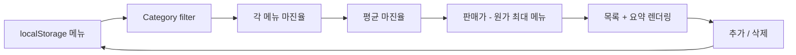

<div align="center">

# 🍽️ Food Strategy Lab

### Cost in. Price in. Margin out.

메뉴의 원가와 판매가를 넣고 **수익 구조를 빠르게 비교하는 framework-free browser tool**입니다.

<p>
  
  
  
</p>

[Features](#features) · [Calculation](#calculation) · [Run](#run)

</div>

---

서버나 프레임워크 없이 메뉴의 **원가·판매가·마진율·절대 수익**을 한 화면에서 비교하기 위해 만든 작은 실험 도구입니다.

## Features

- 메뉴 이름, 원가, 판매가, 카테고리 입력
- 메뉴별 마진율 계산
- 전체 평균 마진율
- 절대 수익이 가장 큰 메뉴 표시
- 카테고리 필터
- 메뉴 삭제 / 샘플 데이터 초기화
- 브라우저 입력 데이터 저장

## Calculation

### Margin

```text
마진율(%) = (판매가 - 원가) / 판매가 × 100
```

### Render flow



> `최고 수익 메뉴`는 **마진율이 가장 높은 메뉴가 아니라 한 개를 팔았을 때 판매가에서 원가를 뺀 금액이 가장 큰 메뉴**입니다.

## Run

의존성이 없어서 `index.html`을 직접 열 수 있습니다.

```bash
python -m http.server 8000
```

## Stack

`HTML` · `CSS` · Vanilla JavaScript · `localStorage`

## Repository note

현재 GitHub 기본 브랜치는 `agent/food-strategy-lab`이지만 `main`도 같은 프로젝트 상태를 유지하도록 동기화해 두고 있습니다.
